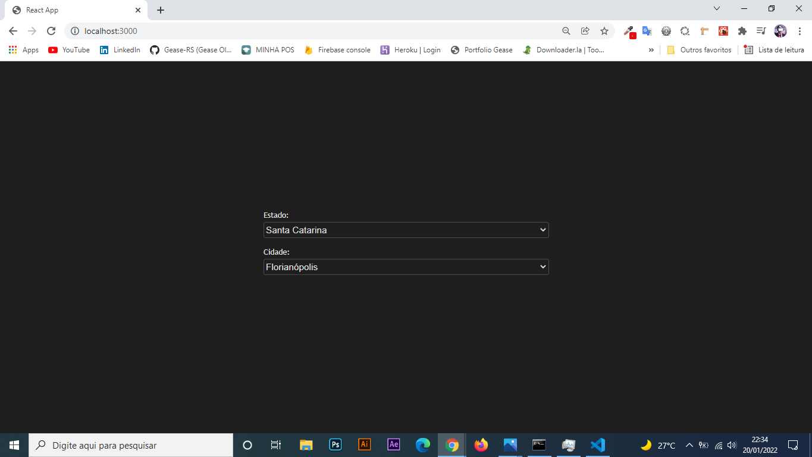

<div align="center">
  <p align="center">
    
  </p>
 <h1>App Dropdown Localidades IBGE </h1>
 <h3>Projeto em Reactjs, consumindo Api do IBGE<h3>
</div>

# Passo a passo terminal

1. Iniciando projeto do zero

```bash
    npx react-create-app react-dropdown-api-localidades
```

2. Entre no projeto criado

```bash
    cd react-dropdown-api-localidades
```

3. Comando para rodar aplicação

```bash
    npm start
```
